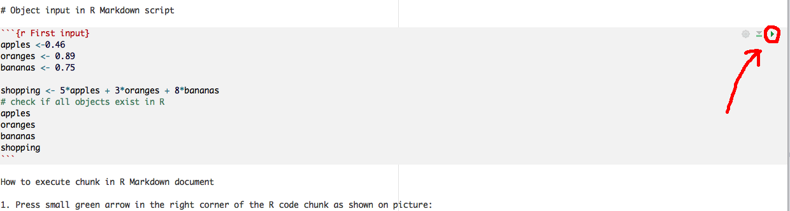

# Getting started

## How to clear a console window

Press CRTL + L and all the content will be deleted in the CONSOLE window!

## Create a folder on your local computer

1. For those in my statistics modules in TCD, you might create a new folder on your student storayge S: DRIVE so that you can access these files from any college computer. Otherwise you might choose a sensible location on your own laptop or desktop depending on how you like to work.
2. Make subfolders for each lesson or project you have
3. As you create these subfolders for different analyses, create a new `Rproject` file using Rstudio's dropdown menu `File` then `New Project...` and either `New Directory` if you have not already created a specific sub-folder in which to work or `Existing Directory` if you have created a folder for your project. 


## A note onworking directories in R

Like many similar packages, R does not have omniscient knowledge of your computer and its contents. It will look for files and write new files by default to wherever its current working directory is set. If you open a blank R studio (or blank R GUI) instance it will default to wherever is set in the global options: typically your local home directory. Changing the location of the `files` pane in Rstudio **_does not_** change the working directory and so you may have difficulty loading data files, or finding any figures or outputs you have saved.

Generally speaking, if you have created an `Rproject` as we recommend, then this issue of setting working directories should never arise for you. Instead, you can open a specific `Rproject` by double clicking on the `*.Rproject` file in a finder or folder browswer window, or by choosing `File`, `Open Project` from Rstudio's dropdown menu, or via the icon in the top right corner of your Rstudio application.

So, while we will run through this here so you are aware of it, the advice is not to do this, at least if you use Rstudio. If you use the standard R GUI then you will need to set your working directory for each analysis and you may need to change the location if you move between computers: this is another great feature of the Rproject approach which means you can share projects between computers, and even between operating systems.

To see your current directory use function:

```{r determine working directory}
getwd()
```

You can change working directory in any of these three ways:

1. Use the setwd R function in Windows:

`setwd("C:/Users/User Name/Documents/FOLDER")`

or on MAC:

`setwd("/Users/User Name/Documents/FOLDER")`
    
2. on Windows: Use the Tools | Change Working Dir
on MAC: Use (Session | Set Working Directory on a mac)


3. Using the `Files` pane, navigate to the folder you want and then select the dropdown menu `More` and then `Set as Working Directory`.


## Open a new R Markdown document

To make new R Markdown document do following:


This is an R Markdown document. Markdown is a simple formatting syntax for authoring HTML, PDF, and MS Word documents. For more details on using R Markdown see <http://rmarkdown.rstudio.com>.

When you click the **Knit** button a document will be generated that includes both content as well as the output of any embedded R code chunks within the document. 
You can embed an R code chunk like this:

This R code chunk calculates summary function for the dataset called cars as follows:

```{r cars}
summary(cars)
```

You can save R Markdows using FILE - SAVE AS.

** Remember that R Markdown file has an .Rmd extension **

*Good name for the file would be Lession_2.Rmd - use underscore instead of space*

When you write text within body of R Markdown it remains as a text, but if you want to write text within R code chunk you have to add # (hash tag) like in ordinary R script.

To create new chunk to write R code on Mac press: *OPTION-CMD-I* and on Windows machine: *Ctrl+Alt+I*


# Object input in R Markdown script

```{r shopping_list}
apples <-0.46
oranges <- 0.89
bananas <- 0.75

shopping <- 5*apples + 3*oranges + 8*bananas
# check if all objects exist in R
apples
oranges
bananas
shopping
```

How to execute chunk in R Markdown document

1. Press small green arrow in the right corner of the R code chunk as shown on picture:




If we want to execute commands line by line we would point to the line of code within R code chunk and in Windows press CTRL + R, and on Mac CMD + ENTER.


```{r enter_data}

# Some Housekeeping

rm(list=ls()) # remove objects currently held in the environment

# These are the lengths of my digits on my left and right hands
# measures in mm.

left <- c(5.8, 7.5, 8.5, 7.3, 5.7)
left
right <- c(5.7, 7.3, 8.3, 7.0, 5.6)
right

# class function determines object type

class(left)
class(right)


# cbind function - binds vectors of equal length!
cbind(left, right)


```
# Plotting in R

## Scatterplot

All plots of data ultimately boil down to scatter plots, with each data point (datum) located somewhere in (usually) 2-dimensional space. To plot the finger length data as we have it currently encoded needs a bit of additional manipulation and organisation. In this example, we are still just making basic figures, as we will learn later how to customise them to improve their appearance: an absolutely essential task if you are to effectively communicate your data and your scientific narrative..

```{r scatter_fingers}

# bundle the fingers together into a single vector by concatenating them
fingers <- c(left, right)

# now create a vector of codes that identify them as left and right.
# This is done using both the rep() function which replicates an entry 
# a specified number of times, and the concatentate function to put them 
# together, which we do in one line of code. In this example, the first 
# 5 fingers are on the left hand which we will encode as "1", 
# and the next 5 are on the right which we will encode as "2".
hand <- c( rep(1, 5) , rep(2, 5) )

# and now we can plot the raw data points as a scatter plot, grouped by each 
# hand. 

plot(fingers ~ hand)

# We need to give the graph some extra space to make it easier to see.
# We can do this by increasing the x axis limits. The axis labels and tick 
# labels are still awful, but we will learn in a later podcast how to 
# tidy a figure like this up.
plot(fingers ~ hand, xlim = c(0, 3))

```


## Boxplot

The scatter plots above are a useful and appropriate way to present data when we do not have very many data points and when they do not overlap much. With a larger number of data points, it becomes useful to summarise their distribution and there are variety of options for doing so: the boxplot is a common and relatively easy and quick way to do this.

Boxplot represents centrality, spread and skewnees of the distribution and with a bit of practice and experience summarise a more detailed histogram of the raw data. The main box is the interquartile range (IQR) and contains the middle 50% of the data (i.e. between 25% and 75%-tiles) and the solid black line is the median (50% data above and below this line). The maximum and minimum extent of the whiskers (dotted lines extending out from the box) is either the max and min of the data or 1.5 times the IQR depending on which is lower (by default anyway; you can override this if you want with an additional argument passed to `boxplot()` when you call it). If there are datapoints beyond this limit they are plotted as stars.


```{r boxplot}

# you might want to look at the spread of your data using e.g. a boxplot
# the function cbind() binds two vectors or matrices together by columns
boxplot( fingers ~ hand )

# open up a new figure for plotting
boxplot(fingers ~ hand, xlab = "Hand", ylab = "Digit length (cm)")
```

Given these data are paired, that is I have the same finger on each hand, we can plot them in a pairwise manner with each hand plotted against the other.

```{r scatter_plot}

# set the figure plot type (pty) to be square
# ?par for more help and options
par(pty = "s")

# you might want to plot one variable against another
plot(right ~ left, xlab = "Left hand", ylab = "Right hand", 
     xlim = c(5,10), ylim = c(5,10), asp = 1)

# draws the 1:1 line of perfect symmetry
# Specifically abline() takes abline(a = intercept, b = slope) and 
# adds it to the figure.
abline(a = 0, b = 1) 
```

## Histograms

They explore distribution of a continuous variable in more detail than a boxplot. It is always good to explore with the bins to get a more complete undestanding of the distribution.

```{r histograms}
hist(left)
hist(right)


```

You can create multi-panel figures using the `par()` function which in its help files lists the many options available for customising plots using the base graphics in R. You can also change aspects of the histograms such as their colour and the number of bins or the location of the bin centres or breaks (see `?hist` for details and examples of these options).

```{r multipanel_histograms}

# set up a multipanel figure. Here with 1 row and 2 columns
par(mfrow = c(1,2))

# with breaks = 16 we define number of bins on x-axis
hist(left, breaks = 16, col="lightgreen", main = "Breaks = 16") 
hist(right, breaks = 16, col="lightblue",  main = "Breaks = 16") 


```


# Summary statistics in R

```{r summaries}
summary(left)
summary(right)
```
# Save data in R

I do not usually recommend saving a copy of all the objects in your environment after an analysis. It is better to save the instructions used to perform the analysis in a script, rather than the results. This way, you have a 1:1 mapping of a set of instructions to an output and this will make checking for errors and sharing your work much easier. There are occasions when it makes sense to save some (or even all) objects to file, such as at the end of an analysis that takes a very long time to run and you dont want to repeat it every time you want the output, or if the objects are very large and you want to save them to disk for later recall and clear them from the memory as you proceed.

Note the `eval = FALSE` argument in the r-chunk which means this is code is not actually evaluated in the R console.

```{r save_data, eval = FALSE}
# Save your data (only if you want)

# The "list=" command tells us which variables we want to save
# The "file=" option tells us what file to save the data to
ls() # see all the objects present in R
save( list = ls(), file = "L2/finger_data.rdata" )
```

**IMPORTANT: As seen in this Second R Markdown script file it is important to make comments with # sign in the R code chunk. It is even important for yourself, while you cannot e-mail to yourself in the past! (Quote: Hadley Wickham)**

#Assignment 1

1. Measure your left and right fingers 
2. Create two variables:
left_yourfirstname <- (Thumb, Index finger, Middle finger, Ring finger and Little finger)
right_yourfirstname <- (Thumb, Index finger, Middle finger, Ring finger and Little finger)
3. Make summary statistics
4. Plot your data
5. Explain results!


