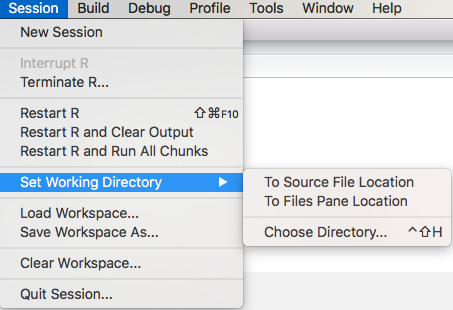
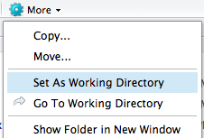
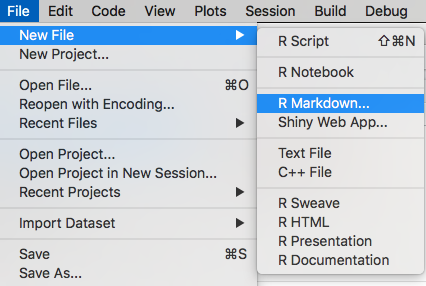
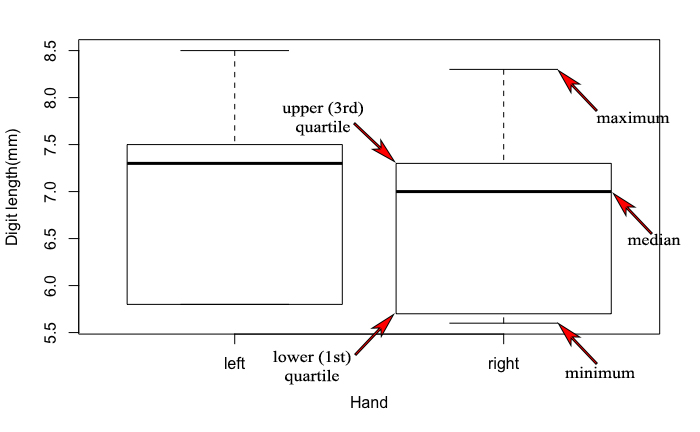

# Getting started

## How to clear a console window

Press CRTL + L and all the content will be deleted in the CONSOLE window!

## Open a folder on your S: DRIVE

1. Create a new folder on your S: DRIVE
2. Make subfolders for each lesson or project you have

## How to create R code chunks in RMarkdown document

To create new chunk to write R code on Mac press: *OPTION-CMD-I* and on Windows machine: *Ctrl+Alt+I*

## Change working directory in R

To see your current directory use function:

```{r determine working directory}
getwd()
```

You can change working directory in any of these three ways:

1. Use the setwd R function in Windows:

`setwd("C:/Users/User Name/Documents/FOLDER")`

or on MAC:

`setwd("/Users/User Name/Documents/FOLDER")`
    
2. on Windows: Use the Tools | Change Working Dir
on MAC: Use (Session | Set Working Directory on a mac)





Navigation within the Files pane alone will not change the working directory. First you have to select folder and then set it as a working directory.


## Open a new R Markdown document

To make new R Markdown document do following:





This is an R Markdown document. Markdown is a simple formatting syntax for authoring HTML, PDF, and MS Word documents. For more details on using R Markdown see <http://rmarkdown.rstudio.com>.

When you click the **Knit** button a document will be generated that includes both content as well as the output of any embedded R code chunks within the document. 
You can embed an R code chunk like this:

This R code chunk calculates summary function for the dataset called cars as follows:

```{r cars}
summary(cars)
```

You can save R Markdows using FILE - SAVE AS.

** Remember that R Markdown file has an .Rmd extension **

*Good name for the file would be Lession_2.Rmd - use undescore insted of space*

When you write text within body of R Markdown it remains as a text, but if you want to write text within R code chunk you have to add # (hash tag) like in ordinary R script.


# Object input in R Markdown script

```{r First input}
apples <-0.46
oranges <- 0.89
bananas <- 0.75

shopping <- 5*apples + 3*oranges + 8*bananas
# check if all objects exist in R
apples
oranges
bananas
shopping
```

How to execute chunk in R Markdown document

1. Press small green arrow in the right corner of the R code chunk as shown on picture:


If we want to execute commands line by line we would point to the line of code within R code chunk and in Windows press CTRL + R, and on Mac CMD + ENTER.


```{r Enter your data in R}

# Some Housekeeping

rm(list=ls()) # remove everything currently held in the R memory

# These are the lengths of my digits on my left and right hands
# measures in mm.

left <- c(5.8, 7.5, 8.5, 7.3, 5.8)
left
right <- c(5.7, 7.3, 8.3, 7.0, 5.6)
right

# class function determines object type

class(left)
class(right)


# cbind function - binds vectors of equal length!
cbind(left, right)


```
# Plotting in R

## Boxplot

Boxplot represents centrality, spread and skewnees of the distribution and with a bit of practice and experience summarise a more detailed histogram of the raw data. The main box is the interquartile range (IQR) and contains the middle 50% of the data (i.e. between 25% and 75%-tiles) and the solid black line is the median (50% data above and below this line). The maximum and minimum extent of the whiskers (dotted lines extending out from the box) is either the max and min of the data or 1.5 times the IQR depending on which is lower (by default anyway; you can override this if you want with an additional argument passed to `boxplot()` when you call it). If there are datapoints beyond this limit they are plotted as stars.




```{r Plot your data in R - Boxplot}

# you might want to look at the spread of your data using e.g. a boxplot
# the function cbind() binds two vectors or matrices together by columns
boxplot( cbind(left, right) )

# open up a new figure for plotting
boxplot(cbind(left,right), xlab = "Hand", ylab = "Digit length(mm)")
```


```{r Plot your data in R - Plot (Scatter plot)}

# you might want to plot one variable against another
plot(left, right, xlab = "Left hand", ylab = "Right hand", 
     xlim = c(5.5,9), ylim = c(5.5,9))

# draws the 1:1 line of perfect symmetry
abline(a = 0, b = 1) 
```

## Histrograms

They explore distribution of a continuous variable in more detail than a boxplot. It is always good to explore with the bins to get a more complete undestanding of the distribution.

```{r Plot your data in R - Plot histogram}
hist(left)
hist(right)


```

You can create multi-panel figures using the `par()` function which in its help files lists the many options available for customising plots using the base graphics in R. You can also change aspects of the histograms such as their colour and the number of bins or the location of the bin centres or breaks (see `?hist` for details and examples of these options).

```{r multipanel_histograms}

# set up a multipanel figure. Here with 1 row and 2 columns
par(mfrow = c(1,2))

# with breaks = 16 we define number of bins on x-axis
hist(left, breaks = 16, col="lightgreen", main = "Breaks = 16") 
hist(right, breaks = 16, col="lightblue",  main = "Breaks = 16") 


```


# Summary statistics in R

```{r Summary statistics in R}
summary(left)
summary(right)
```
# Save data in R

```{r Save data after session in R}
# Save your data (only if you want)

# The "list=" command tells us which variables we want to save
# The "file=" option tells us what file to save the data to
ls() # see all the objects present in R
save( list=ls(), file="finger_data.rdata" )
```

**IMPORTANT: As seen in the Second R Markdown script file it is important to make comments with # sign in the R code chunk. It is even important for yourself, while you cannot e-mail to yourself in the past! (Quote: Hadley Wickham)**

#Assignment 1

1. Measure your left and right fingers 
2. Create two variables:
left_yourfirstname <- (Thumb, Index finger, Middle finger, Ring finger and Little finger)
right_yourfirstname <- (Thumb, Index finger, Middle finger, Ring finger and Little finger)
3. Make summary statistics
4. Plot your data
5. Explain results!


