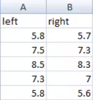
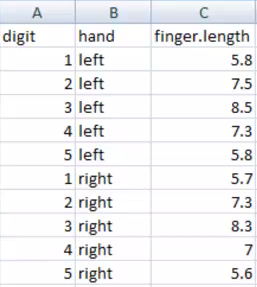

# Housekeeping

Remember that `rm(list=ls())` is not sufficient for a full clean set up of R, and you should use `Ctrl/Cmd-SHIFT-F10` in Rstudio to Restart R cleanly and check that this works at least at the end of your analysis, or periodically during development.

```{r}
# remove (almost) all objects currently held in the R environment
rm(list=ls()) 
```

# Arrange data in Excel

Arrange your data in Excel. 
Save your data under other formats option in Excel as a .csv (comma separated values) file. 
*Remember that name of the variable finger length should be written either as finger.length or finger_lenghth, but not "finger length" as R will add in "." in place of the white spaces on your behalf.*

Change original file which is formatted in the "wide" format to modified file which is in the "long" format in Excel. It is generally much better practice to have each row represent a unique observation, which in this case is each of the 10 digits on my hands. There are other ways to tidy data like this directly in R which we may get on to in later podcasts that use the additional package [tidyr](https://blog.rstudio.com/2014/07/22/introducing-tidyr/). If you want to play around with this package remember you can install it via the code `install.packages("tidyr")`.







After you file has been re-arranged put it in the current working directory. To see all the files in the working directory use:
```{r}
dir()
```

# Read in your data from a Excel csv (comma separated file) file


The table format consist of three key features:

1. Header - representing first row of the data file; usually the variable names. If defined as false R reads first row as observed data values.
2. Delimiter - character used to separate the data entries in each line: usually , or : or ; or the hidden tab character or simply white space.
3. Missing values - R will turn all missing values to NA by default unless otherwise specified.

Usually files to be imported into R have .csv or .txt extension, but we will use .csv extension for files previously edited in Excel. **IMPORTANT - while comma separated files more explicitly demarcate the beginning and end of a cell entry, confusion can occur in some regions, particulalry where "," is used in place of the decimal point, or where "," is routinely used to break long numbers into thousands: Francophone regions and North America I'm particularly looking at you here :)**. There is the alternative function `read.csv2()` that is your friend. In any case, you can gain full control over all the various optional arguments in `read.table` so check the help files if you are still having problems.


On another advisory note: **IMPORTANT - read.table will convert all non-numeric values into factors by default.** We advise you to avoid this, at least unless you specify it explicitly by adding the option `stringAsFactors = FALSE`. Then all non-numeric values will be stored as character and with function `as.factor()` you can convert them to factors as required. Factors are special representations of categorical data in R and is a useful structure for some automated features in plotting and modelling functions: we will meet them shortly in this course.


```{r Importing finger_length.csv in R}
#Be sure your file is in your current R working directory!!!
mydata <- read.csv("finger_lengths.csv", header = TRUE, 
                   stringsAsFactors = FALSE)

# print the contents of my data to screen
mydata

# what is mydata's structure?
str(mydata)
```

*Note the use of the square brackets when addressing arrays or matrices [ , ]* - FIRST ROWS THEN COLUMNS! I (AJ) was taught in school to remember this as *Roman Catholic = RC*: I've never mixed them up since.
```{r}

# interrogate the entries directly by index address
mydata[1,1] # extract the element of the first row and column
mydata[1,2] # extract the element of the first row and second column
mydata[1,3] # extract the element of the first row and third column
mydata[ ,3] # extract all the row elements of the third column
mydata[, c(1, 3)] # extract all the row elements of the first and third column
mydata[, c(-1, -3)] # extract all row elements except first and third column

# using the $ notation
mydata$digit #extract all values for the variable digit
mydata$hand  #extract all values for the variable hand
mydata$finger.length  #extract all values for the variable finger.length
```

Now, in this case, we might want to convert the *hand* column to be a categorical factor, rather than a simple character string.

```{r coerce-hand}

# convert to factor
mydata$hand <- factor(mydata$hand)

# check the structure again
str(mydata)

```

By default, R will set up a factor and use the alphabetic order of the character entries to determine the order of the factor levels. This matters when you try to plot the data, as it will use this same order, and it matters when we model the data too later in the course. When building the factor, you can specify this order manually. Here we would over-write the factor, and this time specify right hand first (this code is not actually evaluated, as it makes sense to me to put the left hand data first, and on the left of the right hand data; try it if you like).

```{r order-factor, eval = FALSE}
# convert to factor
mydata$hand <- factor(mydata$hand, levels = c("right", "left"))

# check the structure again
str(mydata)


```


# Check already available datasets in 
There are many datasets bundled with R that you can use, and many of the examples from the help files will call them.

```{r}
data() # brings up a file listing the built in datasets

# does the same (not run)
# library(help="datasets") # brings up a file listing the built in datasets

```

# Open one of the existing datasets in R

```{r dataset-Orange}

# copies the data and makes it available in the current R environment 
# as an object called Orange.
data(Orange) 

Orange # shows Orange dataset

?Orange # help file describes dataset Orange in detail
```


# Read data from web with read.table

Alternatively, you can read data from data resources hosted on the web, but bear in mind that their urls might not be stable, and certainly not likely in perpetuity.

```{r squirrel-data-url}

SwissSquirrels <-read.table("https://www.mbr-pwrc.usgs.gov/pubanalysis/keryroylebook/SwissSquirrels.txt")

head(SwissSquirrels)
```


# Plot your finger length data with boxplot

Return to the finger length dataset we built.

```{r boxplot}

# Finger.length on y axis and hand on x axis
boxplot(finger.length ~ hand, data = mydata,
        xlab="Hand", ylab="digit length(mm)") 

```

# Save data in R

You can save some or all of the objects currently available in your working environment to `*.rdata` files. There are different types of compression and format you can use but the default is fine for nearly all situations. However, for most analyses, and certainly those involving datasets comprising tens or hundreds of observations, it is usually preferable to not save the results of an analysis like this, and instead re-run the script each time you want to re-create the outputs. 

```{r}
save( list=ls(), file="finger_data.rdata" )
```


# ASSIGNMENT

1. Locate the built-in dataset PlantGrowth and make a boxplot for each of the treatment groups.
What is your conclusion about how the different treatment applications affect growth? You will need to read the associate helpfile for the dataset to make sense of the data and labels.

_Solution available in the raw `*.Rmd` file_


```{r assignment, echo = FALSE, show = FALSE, include = FALSE}
#Solution
boxplot(weight ~ group, xlab = "Group", ylab = "weight", data = PlantGrowth)
```
