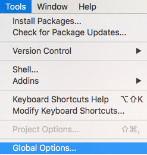
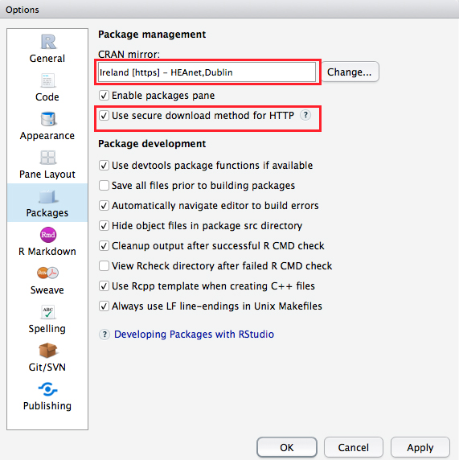
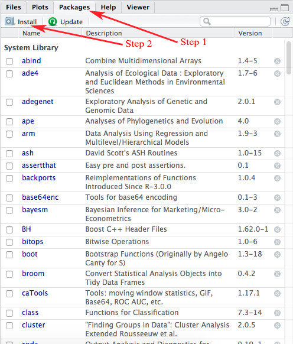
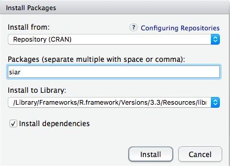
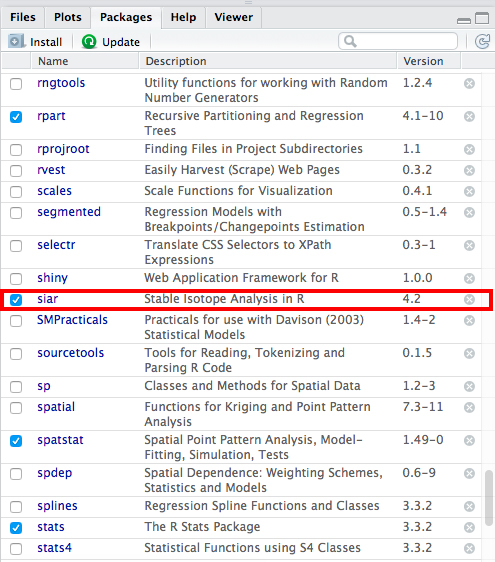
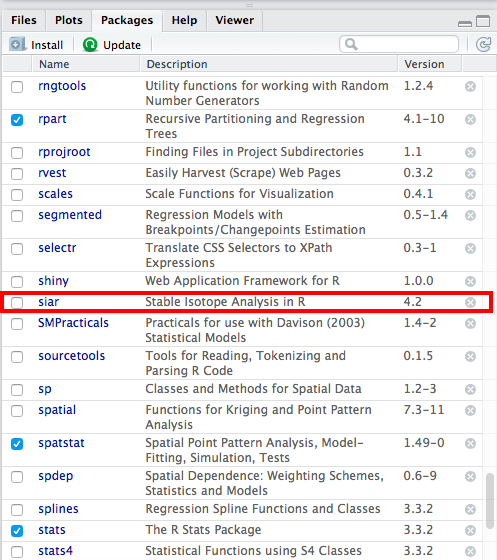
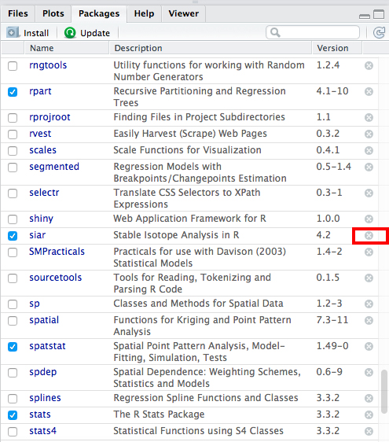
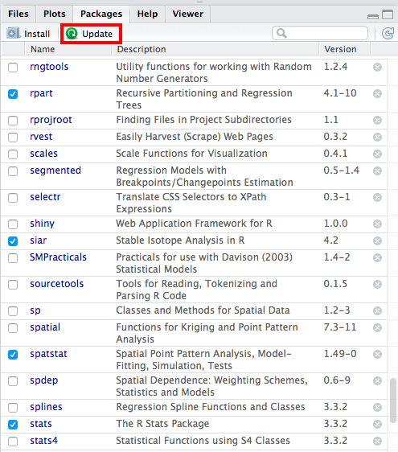

R packages are collections of code that hold data and mainly functions used in R. There are three types of packages within R: 

1. Base packages - packages that come with R installation (base, compiler, datasets, graphics, grDevices, grid, methods, parallel, splines, stats, stats4, tcltk, tools and utils)
2. Recommended packages (boot, class, cluster, codetools, foreign, KernSmooth, lattice, MASS, Matrix, mgcv, nlme, nnet, rpart, spatial, survival) -these packages are not loaded automatically, so you have to load them with function library('name_of_the_package')
2. User-contributed packages - all other packages written by the users.


Many  packages include ”vignettes” which gives an overview of the package and sometimes includes examples.

If you want to see all installed packages you could use function installed.packages(). Under Priority column it is defined if the package is Base or Recommended.

Packages can be installed from anywhere, as long as you have access to the source or binary (compiled) folder containing the package. In order to keep some quality control over user-submitted packages (at least structural quality control) the official repository is hosted by [CRAN](https://cran.r-project.org) and this tutorial will focus on installing from this location. [GitHub](https://github.com) is another popular location for packages and many of them host the raw and development code here and push occasional stable releases to CRAN. Some packages though are not available on CRAN and instead push releases to GitHub. Equally, you may find packages hosted elsewhere, and you could download a copmressed, usually *.zip, folder and install as a local packge. Ultimately, there is no guarantee that any of the code in these packages is actually correct, error free or even doing what you intend, and so, as with R itself, you use them under your own cogniscance.

```{r installed.packages, eval = FALSE}
#installed.packages() - there are a lot of packages, therefore it is mentioned here as a comment
```

# Install packages

**IMPORTANT - To install packages you need an internet connection**

First we have to define CRAN downloading site as shown in new picture:




From R studio version v0.99.467 there is an option for secure downloads from CRAN as shown in picture:




You can install packages in two ways:

1. Through RStudio packages pane 

Fist click packages (*STEP 1*) on Packages pane on the right down part of RStudio screen as shown in the picture Package installation with RStudio. Thereafter click Install (*Step 2*).




Then new window will appear as shown in following picture:



Type in the name of the package you want to install and press Install button.


2. Directly with code

You can install packages directly with code, first you define cran, then package to install and with library at the end you are uploading the package to R
```{r, eval = FALSE}
options(repos=c(CRAN="https://ftp.heanet.ie/mirrors/cran.r-project.org/"))
install.packages('siar') # Be aware that R is case sensitive!
library('siar')
```

**IMPORTANT - When you close you RStudio session, the packages will close too. Therefore, you need to load them next time you want ot use them.**


## Working with already installed packages

One thing that can be essential to bear in mind is that with the proliferation of packges, and the limtations of language, one can end up with two functions with identical names attached via two different pacakges. R will retain both, but you will get a warning along the lines of 

```
"the following object is masked from package:purrr"
    map
```

In this case I loaded an installed library `maps` that has a function called `map` that has masked a similarly named function in the also attached package `purrr`. Masking means both functions still exist and are both available, but hierarchy means that the most recently loaded package will take precedence, and so if we simply call `map`, we will get the `map` function from the package `maps`. We can directly call the function we want within a package using the long-hand call of the form `package::function` (*note the double colon*), and it is best practice to always do this when using a non-base loaded package, which is often. The downside is that it reduces readability of code, at least casually, but increases robustness of the code and once you become more experienced it actually increases readability.

So, to call the functions from each package you would use:

```
maps::map()
purrr::maps()
```


### Detach package

If you wish to detach some of already installed packages you can do it in two ways:

1. Through RStudio packages pane 

You could do that by removing checked box as shown on next picture:



If you uncheck this box (*see picture: uncheck box*) you will see in the Console window following function:

detach("package:siar", unload=TRUE)



However if you want to uninstall package bayesm that is required by package siar you will receive following notice:

package ‘bayesm’ is required by ‘siar’ so will not be detached


2. Directly with code

You can do the same with function detach as follows:

```{r, eval = FALSE}
detach("package:siar", unload = TRUE)
```


### Remove package

You can remove the entire installation of a package from R if you want to clean up your computer and save some space.

1. Through RStudio packages pane 

If you want to remove some of the packages then you have to press X on the right end side of the name of the package as shown in red rectange on the picture.



2. Directly with code


The same can be performed with remove.packages function as follows:

```{r, eval = FALSE}
remove.packages("siar")
```

It is a good idea to restart your R session after doing this in order to refresh the internal table R holds with information on what packages are installed and available. The following shortcut will achieve this in Rstudio `Ctrl/Cmd-SHIFT-F10` or you can find the same command via the dropdown menu `Session -> Restart R`.

```{r}
# remove (almost) all objects currently held in the R environment
rm(list=ls()) 
```


### Update packages

1. Through RStudio packages pane 

If you want to update packages you have to click update and RStudio console will ask you about update for each new package that exist in your list of packages



2. Directly with code

The same can be performed with update.packages function as follows:

```{r, eval=FALSE}
update.packages() # it will ask you in the console window if you want to update packages with multichoice answer (yes/no/cancel)
```

You can force it to ignore the prompt and just go and update using

```{r, eval = FALSE}
update.packages(ask = FALSE)
```


# Help with package installation or removal

[CRAN_help](https://cran.r-project.org/doc/FAQ/R-FAQ.html)

