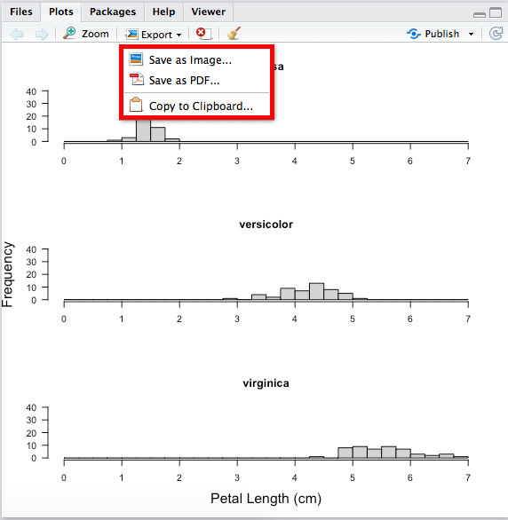

# Housekeeping

Remember that `rm(list=ls())` is not sufficient for a full clean set up of R, and you should use `Ctrl/Cmd-SHIFT-F10` in Rstudio to Restart R cleanly and check that this works at least at the end of your analysis, or periodically during development.

```{r}
# remove (almost) all objects currently held in the R environment
rm(list=ls()) 
```

# Histogram

Histrograms are used to present distribution of continous variable. The accuracy of a histogram depend on the widths of the intervals to bin the data.

# Finding and explore your base data

```{r}
data() # display all built in datasets
?iris # help for data set iris
iris # display iris data set
head(iris) # display first six rows of the iris data set
```


# Plot a frequency histogram of your data and inspect histogram data

In first histogram petal length in iris dataframe is shown. On y-axis there is a frequency or number of observations in each bin.
```{r}
length(iris$Petal.Length)# number of observations for petal length in data set iris
histInformation <- hist(iris$Petal.Length) # display histogram of variable Petal.Length from iris data set
histInformation # displays information about histogram
```

# Plot a density histogram of your data

The option freq=FALSE or prob= TRUE creates a plot based on probability densities rather than frequencies. 

```{r}
hist(iris$Petal.Length, freq=FALSE) 
hist(iris$Petal.Length, prob=TRUE)
```
# Histogram additional options

## Changing the number of the bins (break OPTION)

Bin could be defined in histrogram with break option. Smaller bin result that distribution is more visible. However, to small bins result in presenting too much detail. The default value for breaks option in histogram is breaks = "Sturges". One of the ways to calculate it is The Freedman-Diaconis rule stating h=2∗IQR∗n−1/3. In base R you could use hist(x,breaks="FD"). The bins don’t correspond to exactly the number you put in, because of the way R runs its algorithm to break up the data.
```{r}
hist(iris$Petal.Length, freq=FALSE,  breaks = 20)
hist(iris$Petal.Length, freq=FALSE,  breaks = 50)
hist(iris$Petal.Length, freq=FALSE,  breaks = "Sturges")
hist(iris$Petal.Length, freq=FALSE,  breaks = "FD")
hist(iris$Petal.Length, freq=FALSE,  breaks = seq(from=0, to=10, by=2))
hist(iris$Petal.Length, breaks = seq(min(iris$Petal.Length), max(iris$Petal.Length), length.out = 11)) # exact 10 bins - remember number of bins is n+1
```


## Adding Y axis limits (ylim OPTION)

If you want to specify y axis limits you can do this with *ylim* option:

```{r}
hist(iris$Petal.Length, freq=FALSE, ylim=c(0, 0.6))
```

## Main title (main OPTION)

*Main* is the plotting option to put a title on a graph

```{r}
hist(iris$Petal.Length, freq=FALSE, ylim=c(0, 0.6), main="Main title") # in one line
hist(iris$Petal.Length, freq=FALSE, ylim=c(0, 0.6), main="Main \n title") # in two lines
```

## Add axis labeling (xlab, ylab OPTION)
```{r}
hist(iris$Petal.Length, freq=FALSE, ylim=c(0, 0.6), main="Main title", xlab="Petal length \n (cm)", ylab="Density")
```

## Y axis text orientation (las OPTION)

```{r}
hist(iris$Petal.Length, freq=FALSE, ylim=c(0, 0.6), main="Main title", xlab="Petal length \n (cm)", ylab="Density", las=1)
```

## Adding a density plot

```{r}
hist(iris$Petal.Length, freq=FALSE, ylim=c(0, 0.6), main="Main title", xlab="Petal length \n (cm)", ylab="Density", las=1)
lines(density(iris$Petal.Length), col=2, lwd=3)
```
## Adding normal distribution plot

```{r}
PL <- iris$Petal.Length
hist(PL, prob=TRUE)
x<-seq(1,7,0.01) 
curve(dnorm(x, mean=mean(PL), sd=sd(PL)), add=TRUE)
```

## Adding number of counts for each bin

```{r}
hist(iris$Petal.Length, freq=FALSE, main="Main title", xlab="Petal length \n (cm)", ylab="Density", las=1, labels=TRUE, ylim=c(0, 0.6))

```


## Adding median and mean to the histrogram

```{r}
hist(iris$Petal.Length, freq=FALSE, breaks = 30, main = "Petal length histogram", xlab ="Petal length \n (cm)", ylim=c(0, 0.8), las=1, col="grey")
abline(v=c(mean(iris$Petal.Length), median(iris$Petal.Length)), lty=c(1,3), lwd =2) # lty = 1 (solid line), lty = 2 (dashed line), lty = 3 (dotted line)
legend("topright", legend=c("mean Petal length", "median Petal length"), lty=c(1,3), lwd =2)
mean(iris$Petal.Length)
median(iris$Petal.Length)
```


We can alter the way in which the breaks and hence bins are created and drawn. 


```{r}
par(mfrow=c(2,2)) # specify a 2x2 panel plot
hist(iris$Petal.Length,breaks="Sturges",main="Sturges Method (default)")
hist(iris$Petal.Length,breaks=30,main="30 bins")
hist(iris$Petal.Length,breaks=50,main="50 bins")
hist(iris$Petal.Length,breaks=seq(0,7,0.5),main="bins breaks every 0.5cm")
```


NOT INFORMATIVE WAY TO PRESENT DATA!

```{r}
seq(0,7,0.5)
hist(iris$Petal.Length,breaks=seq(0,7,0.5),main="bins breaks every 0.5cm")
par(mfrow=c(2,2)) # specify a 2x2 panel plot
hist(iris$Petal.Length[iris$Species=="setosa"],  main="setosa", xlab="Petal Length (cm)", ylab="Frequency")
hist(iris$Petal.Length[iris$Species=="versicolor"], main="versicolor", xlab="Petal Length (cm)", ylab="Frequency")
hist(iris$Petal.Length[iris$Species=="virginica"], main="virginica", xlab="Petal Length (cm)", ylab="Frequency")
iris$Species=="setosa"
```

**NOTE** `==` is interpreted as "is it equal to?", *not* "is equal to"!


THE SAME DATA SHOULD BE PRESENTED LIKE THIS - same x and y axis to compare data distribution between species.

```{r, fig.height=12}
par(mfrow=c(3,1)) # specify a 3x1 panel plot

# Species == setosa
hist(iris$Petal.Length[iris$Species=="setosa"], breaks=seq(0,7,0.25),
      main="setosa", xlab="", ylab="", cex.lab=1.5, ylim=c(0, 40), las=1, col="lightgrey")

# Species == versicolor
hist(iris$Petal.Length[iris$Species=="versicolor"], breaks=seq(0,7,0.25),
      main="versicolor", xlab="", ylab="Frequency", ylim=c(0, 40), las=1, cex.lab=1.5, col="lightgrey")

# Species == virginica
hist(iris$Petal.Length[iris$Species=="virginica"], breaks=seq(0,7,0.25),
      main="virginica", xlab="Petal Length (cm)", ylab="", ylim=c(0, 40), las=1, cex.lab=1.5, col="lightgrey")


```


# Save your histogram

If you want to save your image, you can save it as a image (png, jpeg, tiff, bmp, svg, eps), or pdf or save it to the clipboard as 



ASSIGNMENT 1:

From the MASS package create four histograms one above the other (use par function) for each litter (A, B, I and J) from the genotype data set.
Each histogram should have density function, bins from 30 to 70 divided into length of 10 with labels and y - axis scaling from 0 to 0.2, x -axis label should be weight and colours for Litter A - green, Litter B - blue, Litter I - red and Litter J - brown.

*Solution*
```{r}
library(MASS)
par(mfrow=c(3, 1))
hist(PlantGrowth$weight[PlantGrowth$group=="ctrl"], main="Group ctrl", freq=FALSE, breaks=seq(3,7,1),  labels=TRUE, ylim=c(0, 1), xlab="Weight",col="gray")
hist(PlantGrowth$weight[PlantGrowth$group=="trt1"], main="Group trt1", freq=FALSE, breaks=seq(3,7,1),  labels=TRUE, ylim=c(0, 1), xlab="Weight",col="gray")
hist(PlantGrowth$weight[PlantGrowth$group=="trt2"], main="Group trt2", freq=FALSE, breaks=seq(3,7,1),  labels=TRUE, ylim=c(0, 1), xlab="Weight",col="gray")
```


